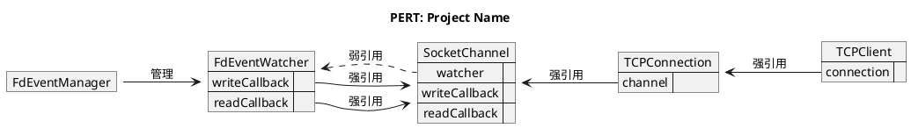

TCP 相关类的关系

```plantuml
@startuml
left to right direction
' Horizontal lines: -->, <--, <-->
' Vertical lines: ->, <-, <->
title PERT: Project Name

map FdEventManager {
}
map FdEventWatcher {
    writeCallback =>
    readCallback =>
}
map FdEventWatcher.2 {
}
map FdEventWatcher.3 {
}

map SocketChannel {
    watcher =>
    writeCallback =>
    readCallback =>
}
map TCPConnection {
    channel =>
}
map TCPClient {
    connection =>
}
FdEventManager --> FdEventWatcher : 管理
FdEventManager --> FdEventWatcher.2 : 管理
FdEventManager --> FdEventWatcher.3 : 管理

FdEventWatcher::writeCallback --> SocketChannel : 强引用
FdEventWatcher::readCallback --> SocketChannel : 强引用
FdEventWatcher <.. SocketChannel::watcher : 弱引用
' SocketChannel::writeCallback --> TCPConnection : 强引用
' SocketChannel::readCallback --> TCPConnection : 强引用
SocketChannel <-- TCPConnection::channel : 强引用
TCPConnection <-- TCPClient::connection : 强引用
@enduml
```

